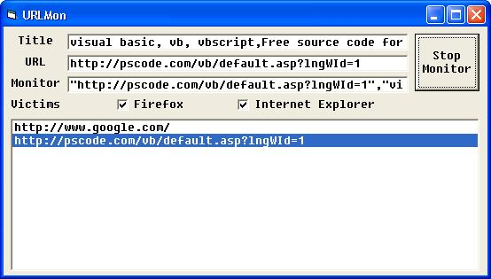



## A Firefox \+ Internet Explorer Web Browser Monitor

### Description

EASY Firefox and Internet Explorer URL and Title monitoring via DDE using a class module I wrote, based on the work of Ferhat_ (Look for "Link Monitor" on PSCode).
 
### More Info
 

             |
---                |---
**Submitted On**   |2005-12-15 11:42:52
**By**             |[r\_t](https://github.com/Planet-Source-Code/PSCIndex/blob/master/ByAuthor/r-t.md)
**Level**          |Intermediate
**User Rating**    |4.6 (23 globes from 5 users)
**Compatibility**  |VB 6\.0
**Category**       |[Internet/ HTML](https://github.com/Planet-Source-Code/PSCIndex/blob/master/ByCategory/internet-html__1-34.md)
**World**          |[Visual Basic](https://github.com/Planet-Source-Code/PSCIndex/blob/master/ByWorld/visual-basic.md)
**Archive File**   |[A\_Firefox\_19568012152005\.zip](https://github.com/Planet-Source-Code/r-t-a-firefox-internet-explorer-web-browser-monitor__1-63658/archive/master.zip)

